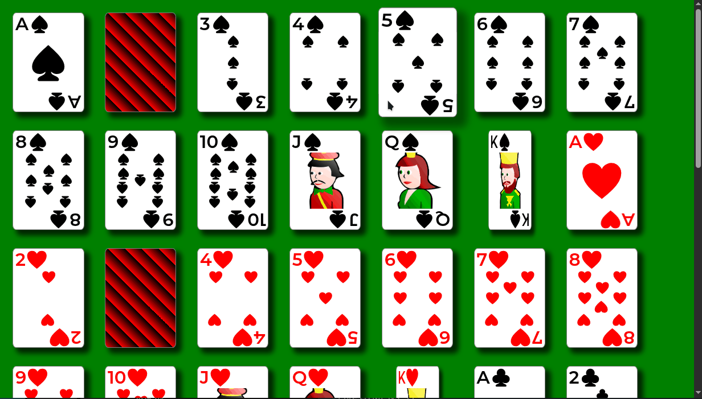

#+title: Standard 52-Card Deck
#+date: <2026-05-01 Fri>
#+author: Richard Frangie
#+language: en

#+html: 
#+html: 

This is a small learning project that render a standard 52-card deck using only HTML and CSS. It's designed to be reuse as a web-component and, eventually, to build a solitaire game.

* Demo

* What it covers
- Pure HTML & CSS
- Responsive card layouts
- Flexbox and CSS Grid for layout
- Positioning and stacking contexts
- Transforms and transitions for simple animations

Some techniques are intentionally over-engineered or implemented in multiple ways for practical purposes.

* Known limitations
When a card rotates via the active animation, the back face does not display. Attempts to fix this caused layout and behavioral issues, so it remains as a known limitation for now.

Tested on Chromium and Firefox

* References
- [[https://www.youtube.com/watch?v=wIGAyJGx2kc&t=125s][ManzDev: 🃏 CSS Cards: Baraja de cartas diseñada sólo con HTML y CSS]]
